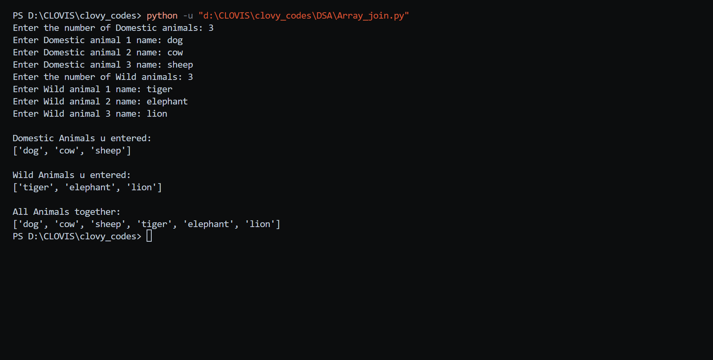
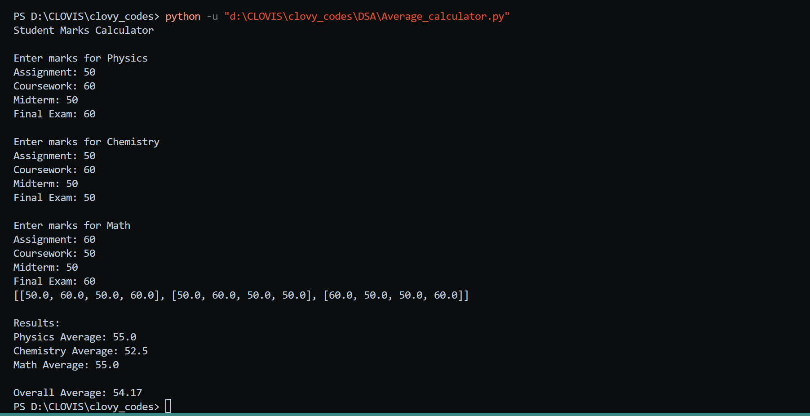

# Data Structures Assignment Submission

## Qn1
Write a Python program that accepts a group of N domestic animals and a group of X wild animals. Your program should print N + X animals after entering each group. The groups should be organized into arrays, and later the arrays are combined and printed. Answer in `Array_join.py` file.

## Qn2
Write a program that calculates the average of marks obtained by a student in three subjects: Physics, Chemistry, and Math. Assume for each subject, four different tests were conducted: assignment, coursework, mid-term, and end-of-term exams. Answer in `Average_Calculator.py` file.

### Writer: ME
